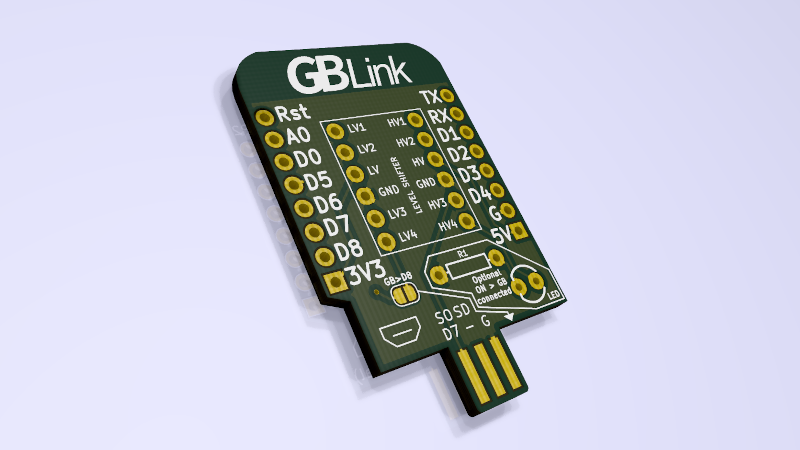

# GB Link Shield

This is a shield to connect your Game Boy Pocket/Light/Color to a [Wemos D1 Mini](https://www.wemos.cc/en/latest/d1/d1_mini.html), a tiny ESP8266 board, or an [MH-ET LIVE MiniKit](https://forum.mhetlive.com/topic/8/mh-et-live-minikit-for-esp32), an ESP32 board that is pin-compatible with the D1 Mini.

The link cable connects directly to the PCB. The shield also has room for an optional resistor + 3mm LED combo. The LED will light up when a Game Boy is connected and powered on.

It can be used with a bunch of cool projects:

- [ESP32 + Phomemo T02 Game Boy Printer](https://github.com/iamjackg/esp32-phomemo-gameboy-printer) https://github.com/iamjackg/esp32-phomemo-gameboy-printer
- [NeoGB Printer](https://github.com/zenaro147/NeoGB-Printer) 
- [ESP8266 Gameboy Printer](https://github.com/applefreak/esp8266-gameboy-printer)

## Pinout

| Game Boy pin  | D1 Mini pin | MiniKit pin |
| ------------- | ------------- | ------------- |
| Ground  | Ground  | Ground |
| Vcc  | D8 (optional, see note) | GPIO5 (optional, see note) |
| Serial Out | D7 | GPIO23 |
| Serial In | D6 | GPIO19 | 
| Clock | D5 | GPIO18 |
| SD | Not connected | Not connected | 

*Vcc Note:* you can optionally bridge the `GB>D8` jumper on the shield. This will pull D8/GPIO5 high (3.3v) when a Game Boy is connected. This is **not** intended to power anything: it's just supposed to be a logic signal. Remember to set the pin to pulldown mode, or it will change state at random!

## Purchasing

You can get this made for about $8 for three copies at [OSHPark](https://oshpark.com/shared_projects/lIuomgBX). Of course, any other PCB fab will also be able to make this. Make sure the PCB is 1.6mm thick so it fits in the Game Boy cable.

## Bill of materials

Since this is just a PCB, you will need some extra components to make it work.

### Required

#### Level shifter

The Game Boy runs at 5V, but both the ESP8266 and the ESP32 use 3.3V. You will need a **level shifter** with the same footprint as the [SparkFun Logic Level Converter](https://www.sparkfun.com/products/12009).

#### Pins

Your ESP board might come with these, but you'll need **two 8-pin male headers** to solder/connect the shield to the microcontroller board. The [https://www.sparkfun.com/products/18221](SparkFun 10-Pin Header) is a good example (you can just snip off two pins).

#### Game Boy Link Cable

This board works with Game Boy Pocket/Light/Color link cables. You can find them for cheap on AliExpress, or for less cheap on Amazon. Just make sure you're not getting the Original Game Boy cable (sometimes called DMG) since it's not the same size and will not work with this shield.

### Optional

#### Resistor and LED

You can use a **330 Ohm resistor** and a **3mm LED**.